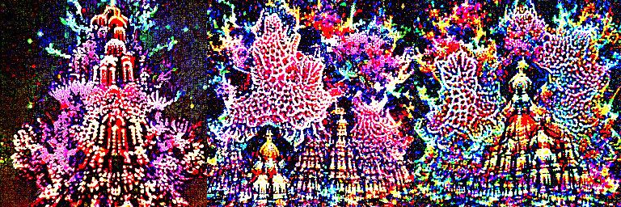

# neodisco

Disco Diffusion's models and technique, running on current GPUs and current PyTorch.

Disco Diffusion produced a look that nothing since has reproduced: over-detailed,
fractal, dreamlike, composed of fragments that half-belong together. Then the notebook
rotted. Its code targets PyTorch 1.10 and Python 3.7, and it will not run on a card
made after 2022.

The models themselves are fine. They are still downloadable, they still work, and this
repository runs them.



OpenAI's 256x256 unconditional ImageNet model from July 2021, on an RTX 5090 under
PyTorch 2.11. Guidance strength 0.5, 2.0, 8.0, left to right. Prompt: *a fractal
cathedral of glowing coral, intricate, dreamlike*.

## Why nothing else looks like this

The Disco look was never a style you could ask a model for. It was the visible residue of
a mechanism:

- an **unconditional** diffusion model trained on ImageNet, which knew textures but was
  never taught to compose a scene and never saw a word of text;
- **CLIP guidance** applied through dozens of random crops at random scales, so detail
  accumulated independently at every scale with nothing tying it together;
- **hundreds of steps** at high guidance, long enough for the two to grind against each
  other.

Current text-to-image models cannot make these pictures because they are too good. They
have strong text conditioning and learned composition, so they produce coherent images.
The Disco look is what a weak prior fighting a weak guidance signal looks like, and the
only way to get it back is to run that fight again.

## Models

Both are unconditional ImageNet diffusion models, and both are still up:

| Checkpoint | Source | Size |
|---|---|---|
| `256x256_diffusion_uncond.pt` | OpenAI, July 2021 | 2.21 GB |
| `512x512_diffusion_uncond_finetune_008100.pt` | Katherine Crowson's finetune, the one Disco used by default | 2.23 GB |

```bash
mkdir -p weights/disco && cd weights/disco
curl -LO https://openaipublic.blob.core.windows.net/diffusion/jul-2021/256x256_diffusion_uncond.pt
curl -LO https://huggingface.co/lowlevelware/512x512_diffusion_unconditional_ImageNet/resolve/main/512x512_diffusion_uncond_finetune_008100.pt
```

## Install

```bash
pip install -e .
```

The sampling half of [openai/guided-diffusion](https://github.com/openai/guided-diffusion)
is vendored under `neodisco/backends/_guided_diffusion` (MIT, see the NOTICE there). The
upstream package depends on `mpi4py` and `blobfile` for training and data loading, neither
of which sampling needs and both of which make it awkward to install today.

## Use

If you have a settings file from the Disco notebook, point it at that. Prompts, weights,
which CLIP models were ticked, the cutout schedules, `eta`, `skip_steps`, the seed, and
the frame size all come through; animation and video keys are ignored.

```bash
python -m neodisco.cli --disco-config examples/cobanov-spaceship.json --out spaceship.png
```

Any flag given on the command line overrides the file, so a quick low-resolution
preview of an old config is:

```bash
python -m neodisco.cli --disco-config settings.json --width 640 --height 384 --steps 60
```

Without a file, describe the picture directly:

```bash
python -m neodisco.cli \
  "a lush alien jungle city at golden hour, by Moebius" \
  --image-size 512 --width 1280 --height 768 --steps 250 --eta 0.8 \
  --overview-cuts "[12]*400+[4]*600" --inner-cuts "[4]*400+[12]*600" \
  --cutn-batches 4 --strength 3.0 --out out.png
```

The frame can be any size that is a multiple of 64; the network is convolutional and its
attention runs on whatever grid it is handed, which is how Disco made widescreen frames
from a model trained at 512x512.

Weight several prompts against each other with `::`:

```bash
python -m neodisco.cli "an ukiyo-e woodblock print::1.0" "neon::0.4" --image-size 256
```

## The knobs that change the look

| Flag | Does |
|---|---|
| `--strength` | how hard the prompt pulls against the prior |
| `--eta` | 0 is deterministic DDIM, 1 is ancestral DDPM. Disco used 0.8 |
| `--cutn-batches` | how many independent cutout draws are averaged per step |
| `--overview-cuts`, `--inner-cuts` | a number, or a Disco schedule string like `"[12]*400+[4]*600"` |
| `--inner-cuts` | detail density. Low is calm, high is the full fractal surface |
| `--steps` | how long the two are allowed to fight |
| `--overview-cuts` | how much the prompt affects overall composition |
| `--tv-scale` | smooths the speckle that guidance introduces. 0 is grittier |
| `--clip-models` | more backbones means more compositing, less literal |
| `--cut-batch` | memory only. Lower it if the card runs out |
| `--grad-checkpoint` | trades speed for memory inside the UNet |

## Notes for anyone porting this technique

Three things go wrong in ways that are quiet rather than loud, and all three cost time:

**An absolute guidance scale does not survive the sampler.** Disco's `clamp_max=0.05` is
tuned for its own step parameterisation. Carry the number across to a different sampler
and the guidance term, once multiplied by the step size, rounds away to nothing: the
image comes out clean, coherent and completely ignoring the prompt. Here the gradient is
normalised and scaled relative to the step's own magnitude, so `--strength 1.0` means the
prompt pulls about as hard as the prior does, whatever the sampler.

**The clean-image estimate should not be rebuilt from the noise prediction.** Writing
`eps = (x - sqrt(a) * x0) / sqrt(1 - a)` and then differentiating through it is the
obvious formulation and it divides by zero at the end of sampling. Take the gradient with
respect to the estimate directly and divide by `sqrt(alpha_bar)` instead.

**Group cutout gradients in image space, not through the decoder.** Chunking the CLIP
pass to save memory is necessary, but if each chunk backpropagates all the way through a
decoder, sampling slows by the number of chunks for no change in the answer.

## Licence

MIT. Vendored guided-diffusion code is MIT, copyright OpenAI.
