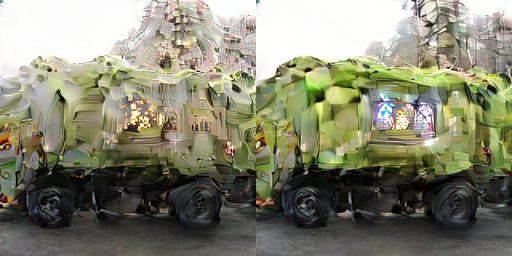

# neodisco

CLIP-guided diffusion, the Disco Diffusion technique, running on current GPUs and current
PyTorch, against modern backbones.

Disco Diffusion produced a look that nothing since has reproduced: over-detailed,
fractal, dreamlike, composed of fragments that half-belong together. That look was never
a style you could prompt for. It was the visible residue of a mechanism:

- an **unconditional** diffusion model trained on ImageNet, which knew textures but had
  never been taught to compose a scene, and had never seen a word of text;
- **CLIP guidance** applied through dozens of random crops at random scales, so detail
  accumulated independently at every scale with nothing tying it together;
- **hundreds of steps** at high guidance, long enough for the two to grind against each
  other.

Modern text-to-image models cannot make these pictures because they are too good. They
have strong text conditioning and learned composition, so they produce coherent images.
The Disco look is what a weak prior fighting a weak guidance signal looks like.

This repository rebuilds the mechanism rather than imitating the output, and lets you
point it at any prior you like, including one you trained yourself.

## What it looks like


Guidance strength 0, 0.5, 1.5, 4.0, left to right. Same seed, same prior, same prompt
("a fractal cathedral of glowing coral"). At zero you get what the model was trained on,
a golf ball on grass. Turn it up and coral architecture grows out of it. Nothing else
changed.



250 steps, 36 cutouts, two CLIP backbones. The prior here is a small model trained on ten
ImageNet classes, and it insists on a garbage truck; CLIP insists on a cathedral of coral
(left) and a temple of stained glass and moss (right). The wheels survive. That argument,
visible in the result, is the whole point.

## What is here

- **Faithful cutouts.** `MakeCutoutsDango` ported to current torchvision: overview cuts
  for composition, power-law inner crops for detail, the same augmentation stack.
- **Faithful losses.** Spherical distance on the unit sphere, total variation, range and
  saturation penalties.
- **A CLIP bank.** Several CLIP backbones evaluated together, the way Disco ran them, so
  the image has to satisfy all of them at once.
- **Two backends.** A rectified-flow latent DiT (LightningDiT + VA-VAE), and, planned,
  OpenAI's original 256/512 unconditional pixel models, which are still downloadable.
- **Memory that scales down.** Cutouts are grouped and their image-space gradients summed
  before a single pass back through the decoder, so a high cut count does not need a big
  card.

## Guidance strength

Guidance is scaled relative to the model's own velocity, so `--strength 1.0` means "the
prompt pulls about as hard as the prior does". An absolute scale does not survive being
multiplied by the step size; it silently rounds away to nothing, which is the first thing
that goes wrong when people port this technique.

## Usage

```bash
python -m neodisco.cli \
  "a fractal cathedral of glowing coral, intricate, dreamlike" \
  --backend latent-flow \
  --config /path/to/LightningDiT/configs/imagenette_b1.yaml \
  --ckpt   /path/to/checkpoints/0060000.pt \
  --steps 250 --strength 3.0 --inner-cuts 32 --cut-batch 6 \
  --out out.png
```

Weight several prompts with `::`:

```bash
python -m neodisco.cli "a ukiyo-e woodblock print::1.0" "neon::0.3" ...
```

Knobs that change the look, in rough order of effect:

| Flag | Does |
|---|---|
| `--strength` | how hard the prompt pulls against the prior |
| `--inner-cuts` | detail density. Low is calm, high is the full fractal surface |
| `--steps` | how long the two are allowed to fight |
| `--overview-cuts` | how much the prompt affects overall composition |
| `--clip-models` | more backbones means more compositing, less literal |
| `--cut-batch` | memory only; lower it if the card runs out |

## Status

Working: latent-flow backend, cutouts, losses, CLIP bank, memory-scaled gradient.
Planned: OpenAI guided-diffusion pixel backend, init images, animation.
