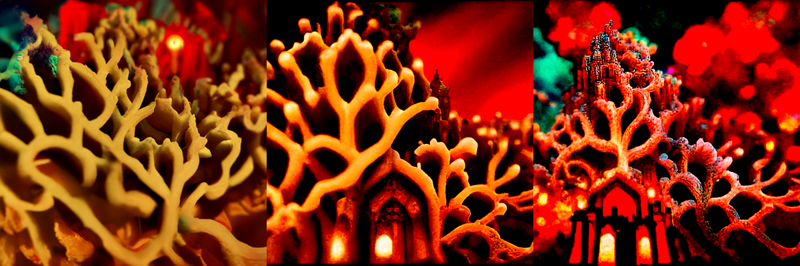

<p align="center">
  
</p>

<p align="center">
  Disco Diffusion's models and technique, running on current GPUs.<br>
  The 2021 checkpoints, PyTorch 2.11, a card made this year.
</p>

<p align="center">
  
  
  
  <a href="LICENSE"></a>
</p>

---

Disco Diffusion produced a look that nothing since has reproduced: over-detailed,
fractal, dreamlike, composed of fragments that half-belong together. Then the
notebook rotted. Its code targets PyTorch 1.10 and Python 3.7, and it will not run
on a card made after 2022.

The models themselves are fine. They are still downloadable, they still work, and
this repository runs them.

Above is `examples/cobanov-spaceship.json`, a settings file from 2022 run unchanged on an
RTX 5090 under PyTorch 2.11: Crowson's 512 model at 1280x768, three CLIP backbones, Disco's
cutout schedules, `eta 0.8`, the original seed.

- **The original checkpoints, not a lookalike.** Both unconditional ImageNet
  diffusion models Disco used, loaded as they are.
- **Disco settings files load directly.** Point `--disco-config` at a `.json` from
  the notebook and the prompts, weights, cutout schedules, `eta`, `skip_steps` and
  seed all come through.
- **Any frame size that is a multiple of 64.** The network is convolutional and its
  attention runs on whatever grid it is handed, which is how Disco made widescreen
  frames from a model trained at 512x512.
- **Guidance that survives a change of sampler.** The gradient is normalised against
  the step's own magnitude, so a strength number means the same thing whatever the
  sampler underneath.

## Models

Both are unconditional ImageNet diffusion models, and both are still up:

| Checkpoint | Source | Size |
|---|---|---|
| `256x256_diffusion_uncond.pt` | OpenAI, July 2021 | 2.21 GB |
| `512x512_diffusion_uncond_finetune_008100.pt` | Katherine Crowson's finetune, the one Disco used by default | 2.23 GB |
| `secondary_model_imagenet_2.pth` | Crowson's secondary model; Disco took the CLIP gradient through this by default | 53 MB |

```bash
mkdir -p weights/disco && cd weights/disco
curl -LO https://openaipublic.blob.core.windows.net/diffusion/jul-2021/256x256_diffusion_uncond.pt
curl -LO https://huggingface.co/lowlevelware/512x512_diffusion_unconditional_ImageNet/resolve/main/512x512_diffusion_uncond_finetune_008100.pt
curl -LO https://huggingface.co/spaces/huggi/secondary_model_imagenet_2.pth/resolve/main/secondary_model_imagenet_2.pth
```

The secondary model matters more than its size suggests. Disco's `use_secondary_model` was
on by default, and it changes the *direction* of guidance, not just its cost: the CLIP
gradient is taken through a 14M-parameter network that predicts the clean image, rather
than through the 550M-parameter UNet, and the result is the softer, more painterly steer
people remember. On the same settings file, CLIP distance to the prompt after 250 steps
drops from 6.10 (unguided) to 5.25 with the secondary model, against 5.77 through the
UNet. Pass `--no-secondary` to use the UNet path.

## Install

```bash
pip install -e .
```

The sampling half of [openai/guided-diffusion](https://github.com/openai/guided-diffusion)
is vendored under `neodisco/backends/_guided_diffusion` (MIT, see the NOTICE there).
The upstream package depends on `mpi4py` and `blobfile` for training and data loading,
neither of which sampling needs and both of which make it awkward to install today.

## Use

If you have a settings file from the Disco notebook, point it at that. Animation and
video keys are ignored; everything else comes through.

```bash
python -m neodisco.cli --disco-config examples/cobanov-spaceship.json --out spaceship.png
```

That is the picture at the top of this page. Any flag given on the command line overrides the file, so a quick low-resolution
preview of an old config is:

```bash
python -m neodisco.cli --disco-config settings.json --width 640 --height 384 --steps 60
```

Without a file, describe the picture directly:

```bash
python -m neodisco.cli \
  "a lush alien jungle city at golden hour, by Moebius" \
  --image-size 512 --width 1280 --height 768 --steps 250 --eta 0.8 \
  --overview-cuts "[12]*400+[4]*600" --inner-cuts "[4]*400+[12]*600" \
  --cutn-batches 4 --strength 3.0 --out out.png
```

Weight several prompts against each other with `::`:

```bash
python -m neodisco.cli "an ukiyo-e woodblock print::1.0" "neon::0.4" --image-size 256
```

### Web UI

```bash
pip install -e ".[webui]"
python -m neodisco.server --weights weights/disco --out outputs
```

A page on `http://127.0.0.1:7870` with every setting above, Disco's defaults filled in, a
slot for an old settings `.json`, and an init-image field. One GPU means one render at a
time, so requests go into a queue and the page polls for step-by-step progress rather than
holding a request open for the two minutes a 1280x768 run takes. Finished renders stay in
a strip you can click back through, and the settings actually used come back as JSON next
to each image, so anything you like can be re-run or handed to someone else. `--host
0.0.0.0` exposes it on your network.

### Upscaling with an init image

Disco never had a 2048-pixel model; it had `init_image` and `skip_steps`. Render small,
then run again at the larger frame starting from that render instead of from noise, with
about half the steps skipped. The composition survives and the guidance repaints the
detail at the new size.


```bash
python -m neodisco.cli --disco-config settings.json --width 640 --height 384 --out small.png
python -m neodisco.cli --disco-config settings.json --width 1280 --height 768 \
  --init-image small.png --skip-steps 125 --init-scale 1000 --out large.png
```

`--init-scale` is Disco's LPIPS pull toward the init (it needs `pip install lpips`);
`--skip-steps` sets how much of the init survives, 125 of 250 keeps the composition,
50 lets the model wander further from it.

### The knobs that change the look

| Flag | Does |
|---|---|
| `--clamp-max` | Disco's guidance strength: the cap on the gradient's RMS per step. 0.02 calm, 0.05 default, 0.10 intense |
| `--eta` | 0 is deterministic DDIM, 1 is ancestral DDPM. Disco used 0.8 |
| `--overview-cuts` | how much the prompt affects overall composition. A number, or a Disco schedule string like `"[12]*400+[4]*600"` |
| `--inner-cuts` | detail density. Low is calm, high is the full fractal surface |
| `--steps` | how long the prior and the guidance are allowed to fight |
| `--tv-scale` | smooths the speckle that guidance introduces. 0 is grittier |

`--cutn-batches` averages more independent cutout draws per step, `--clip-models` adds
backbones (more compositing, less literal), and `--cut-batch` and `--grad-checkpoint` trade
memory against speed without changing the picture. `--strength` is the step-relative scale
used only with `--clamp-max 0`. `--help` has the rest.

### What the strength knob does



The one knob Disco actually exposed for guidance strength is `clamp_max`, the cap on the
gradient's RMS per step. Left to right: 0.02, 0.05 (Disco's default), 0.10. Same seed,
same prompt (*a fractal cathedral of glowing coral, intricate, dreamlike*), Crowson's 512
model with the secondary model, 250 steps. At 0.02 the prior mostly wins and you get
coral; at 0.05 the cathedral arrives; at 0.10 the prompt is grinding hard enough that the
frame starts to bloom and the range term has to hold it in.

## Why nothing else looks like this

The Disco look was never a style you could ask a model for. It was the visible
residue of a mechanism:

- an **unconditional** diffusion model trained on ImageNet, which knew textures but
  was never taught to compose a scene and never saw a word of text;
- **CLIP guidance** applied through dozens of random crops at random scales, so
  detail accumulated independently at every scale with nothing tying it together;
- **hundreds of steps** at high guidance, long enough for the two to grind against
  each other.

Current text-to-image models cannot make these pictures because they are too good.
They have strong text conditioning and learned composition, so they produce coherent
images. The Disco look is what a weak prior fighting a weak guidance signal looks
like, and the only way to get it back is to run that fight again.

## Speed

Measured on an RTX 5090, the example settings file at 1280x768, 250 steps, three CLIP
backbones, `cutn_batches 4`, secondary model. CLIP distance to the prompt is reported so
that speed is never bought with a different picture.

| | time | peak VRAM | CLIP distance |
|---|---|---|---|
| original einsum attention, fp32 | 201 s | 14.5 GB | 5.141 |
| fused attention (SDPA), fp32 | 201 s | 14.5 GB | 5.180 |
| SDPA + bf16 autocast on the UNet | 180 s | 13.3 GB | 5.139 |
| + `--cut-batch 64` (default) | **143 s** | 20.8 GB | 5.142 |

What the table says. Fused attention on its own changes nothing end to end, even though
the attention kernel alone is 8x faster in bf16: the UNet forward is not where the time
goes. bf16 on the UNet is a free 10 percent that also removes the fp16 overflow problem.
The real cost is the guidance, 3 CLIP models x 4 draws x 16 cutouts, forward and backward,
every step, and most of *that* was launch overhead from scoring the cutouts in small
groups: going from 16 to 64 per group made the guidance pass 3x faster with an identical
gradient (cosine 0.998 against the chunked version). It costs memory; on a 12 GB card use
`--cut-batch 16`.

One thing that does not work: running CLIP itself under bf16. It is barely faster (the
cost is launches, not math) and it changes the gradient direction substantially (cosine
0.46 against fp32). CLIP stays in fp32.

Profile of one step at 1280x768 after these changes: UNet forward ~256 ms, CLIP guidance
~144 ms, secondary model ~22 ms, cutouts ~18 ms. The UNet is now the largest item;
`torch.compile` on it is the next lever.

## How it is built

These go wrong in ways that are quiet rather than loud, and every one of them cost time.

**An absolute guidance scale does not survive the sampler.** Disco's `clamp_max=0.05` is
tuned for its own step parameterisation. Carry it to a different sampler and the guidance
term, once multiplied by the step size, rounds away to nothing: the image comes out clean,
coherent and completely ignoring the prompt. `--strength` exists for that case, scaling the
gradient relative to the step's own magnitude instead.

**The clean-image estimate should not be rebuilt from the noise prediction.** Writing
`eps = (x - sqrt(a) * x0) / sqrt(1 - a)` and differentiating through it is the obvious
formulation, and it divides by zero at the end of sampling. Take the gradient with respect
to the estimate directly and divide by `sqrt(alpha_bar)`.

**Do not hand-roll the DDIM step.** The update looks like four lines of algebra, and the
trap is `alphas_cumprod_prev`: on a respaced schedule the previous step is not index
`i - 1` of the original array. Getting it wrong does not blow up, it just darkens and
over-saturates every render by a little, which is impossible to attribute without a
reference to compare against. Call the vendored `ddim_sample` and pass guidance as a
`cond_fn`, the way Disco did. With `eta=0` this file now reproduces
`ddim_sample_loop` bit for bit.

**Pad the frame to a square for the overview cuts, on the short axis.** Padding the wide
axis instead letterboxes nothing and hands CLIP a horizontally squashed picture; every
non-square render then gets a subtly wrong gradient for its whole run.

**Cut and augment in [0, 1], not [-1, 1].** ColorJitter and the small additive noise in
Disco's augmentation stack assume a [0, 1] image. Run them on [-1, 1] data and the colour
augmentations misbehave, which quietly shifts the palette of every run.

**Use Disco's `ddim<N>` respacing.** `space_timesteps(1000, "ddim250")` picks every
fourth timestep from zero; the plain `"250"` spacing is a different set of timesteps.

**fp16 can overflow on large frames.** The checkpoints were trained in fp16 and run
fine that way at 512x512, but at widescreen sizes the attention over a few thousand
tokens overflows on some seeds and the frame comes out blank. The sampler now stops
with a clear error instead of writing the blank. The UNet therefore runs in fp32 by
default; `--fp16` is opt-in for square frames on small cards.

**Group cutout gradients in image space, not through the decoder.** Chunking the CLIP pass
to save memory is necessary, but if each chunk backpropagates through a decoder, sampling
slows by the number of chunks for no change in the answer.

The same guidance also runs against our own rectified-flow latent models, trained from scratch on a single GPU; that lives in a separate project, `cobanov-diffusion`, which imports this package for the cutouts, losses and CLIP bank.

## Licence

MIT. Vendored guided-diffusion code is MIT, copyright OpenAI.
